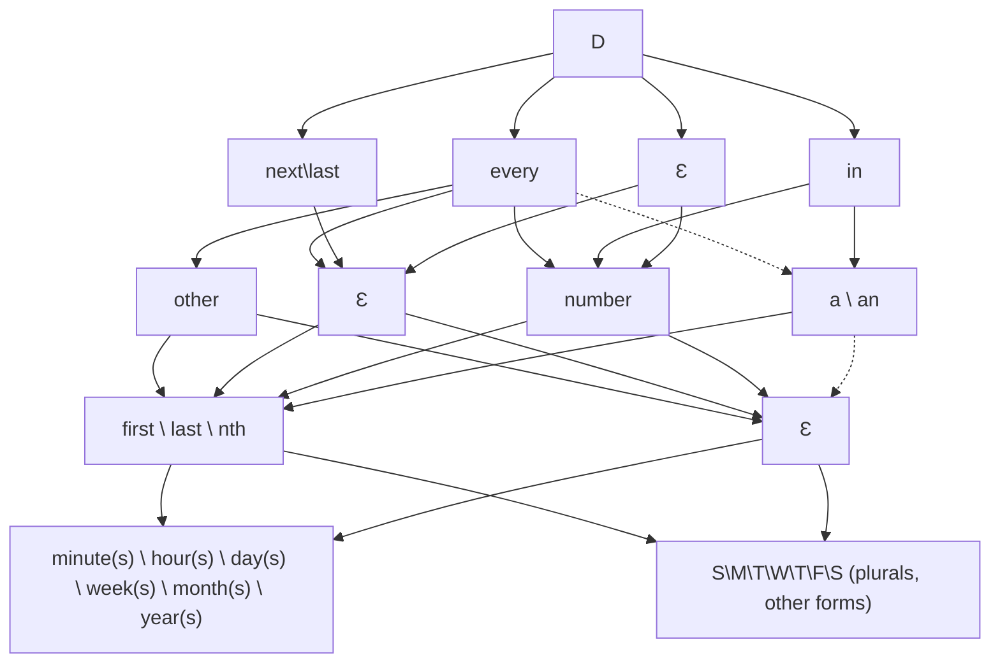
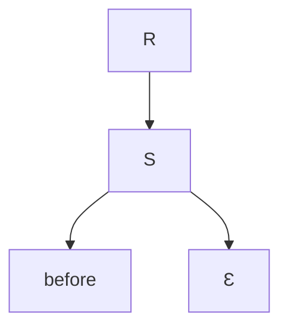

## CFG

TODO: Grammar generator
TODO: Parser test suite

```
D = SINGLE | OFFSET DURATION_MULT TIME | FREQUENCY DURATION_MULT TIME BOUNDS
SINGLE = today | tomorrow | yesterday
OFFSET = in | Ɛ
FREQUENCY = every | next | previous
# other = 2, a = 1
DURATION_MULT = other | NUMBER | a | an | Ɛ   # watch out--could be a number
  NUMBER = <number> | NUMBER number # tens ones, etc
TIME = DAYSPECIFIER | TIMEDURATIONSPECIFIER | DAYSPECIFIER AT TIMESPECIFIER
  DAYSPECIFIER =  WEEKDAY | DATE | day(s) | week(s) | month(s) | year(s)
    DATE = MONTHSTRING DAY | MONTHNUM / DAY | DAY
      # union the two months?
      MONTHSTRING = jan | mar | may | jun | july | aug | nov | dec | february | april | sept | october
      MONTHNUM = NUMBER
      DAY = NUMBER | two | five | eight | fourteen | third | sixth | ninth | fifteenth
    WEEKDAY = SUN | MON | TUE | WED | THU | FRI | SAT | WEEKDAY OR WEEKDAY
      SUN = sunday | sun | s
      MON = monday | mon | m
      TUE = tuesday | tue | tu
      WED = wednesday | wed | w
      THU = thursday | thu | th
      FRI = friday | fri | f
      SAT = saturday | sat | s
      OR = , | ", " | or
  TIMEDURATIONSPECIFIER =  minute(s) | hour(s)
  AT = at | Ɛ
  TIMESPECIFIER = HOUR | HOUR : MIN
    HOUR = NUMBER
    MIN = NUMBER
BOUNDS = STARTBOUNDS_WITH_TIME ENDBOUNDS_WITH_TIME
  STARTBOUNDS_WITH_TIME = STARTBOUNDS TIME | Ɛ
    STARTBOUNDS = after | starting | from
  ENDBOUNDS_WITH_TIME = ENDBOUNDS TIME | Ɛ
    ENDBOUNDS = until | ending | before | ago | except | to
  EXCEPTIONS =  except TIME | except TIME OR TIME | Ɛ

# Reminders
# this (this Friday)
# each (every)
# last
# first

```

<!--
%%{init: {"flowchart": {"defaultRenderer": "elk"}} }%%
-->

## Due Dates



## Reminders


