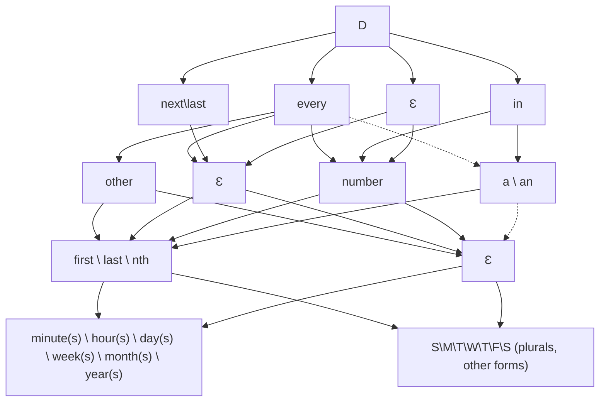
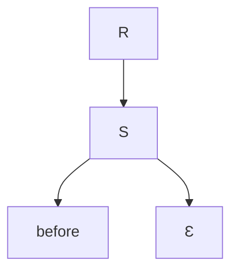

## CFG

TODO: Grammar generator
TODO: Parser test suite

```
D = SINGLE | FREQUENCY
SINGLE = today | tomorrow | yesterday
FREQUENCY = every DURATION_MULT TIME | next DURATION_MULT TIME | in DURATION_MULT TIME | Ɛ DURATION_MULT TIME
DURATION_MULT = other | <number> | a | an | Ɛ
TIME = DURATION | WEEKDAY
DURATION = minute(s) | hour(s) | day(s) | week(s) | month(s) | year(s)
WEEKDAY = SUN | MON | TUE | WED | THU | FRI | SAT | WEEKDAY OR WEEKDAY
SUN = sunday | sun | s
MON = monday | mon | m
TUE = tuesday | tue | tu
WED = wednesday | wed | w
THU = thursday | thu | th
FRI = friday | fri | f
SAT = saturday | sat | s
OR = , | ", " | or
```

<!--
%%{init: {"flowchart": {"defaultRenderer": "elk"}} }%%
-->

## Due Dates

after
starting
until
ending
before
ago
from_now
dateObj



## Reminders


